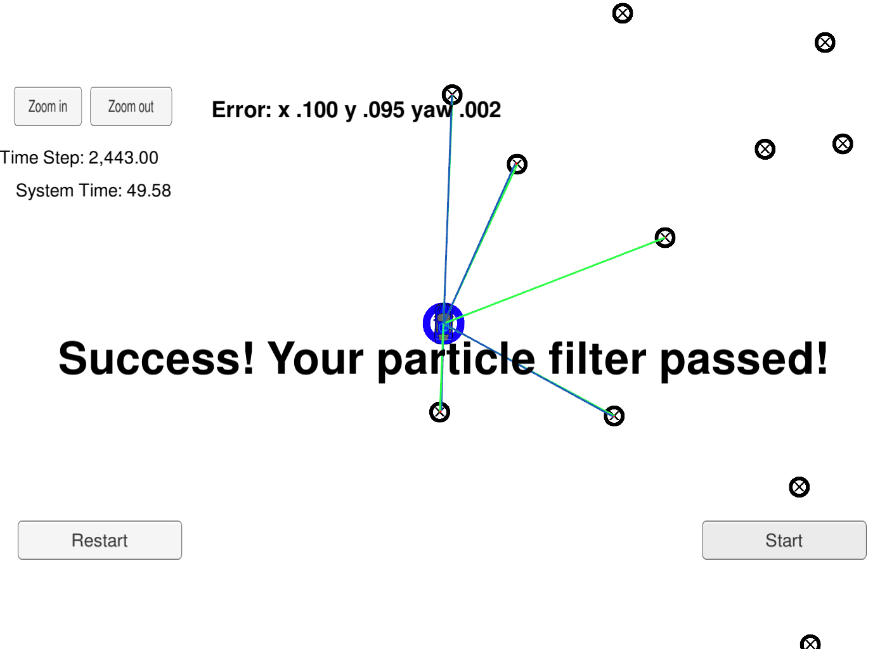

# Overview
This repository contains all the code needed to complete the Particle Filter project for the Localization course in Udacity's Self-Driving Car Nanodegree.
 

## Running the Code
This project involves a Simulator which can be downloaded [here](https://github.com/udacity/self-driving-car-sim/releases)

This repository includes two files that can be used to set up and intall uWebSocketIO for either Linux or Mac systems. For windows you can use either Docker, VMware, or even Windows 10 Bash on Ubuntu to install uWebSocketIO.

Once the install for uWebSocketIO is complete, the main program can be built and ran by doing the following from the project top directory.

1. mkdir build
2. cd build
3. cmake ..
4. make
5. ./particle_filter

Alternatively some scripts have been included to streamline this process, these can be leveraged by executing the following in the top directory of the project:

1. ./clean.sh
2. ./build.sh
3. ./run.sh

### Write-up

#### 1. Accuracy
The errors are less than 15cm and 0.1 deg. (As shown in the picture above)

#### 2. Performance
The PF runs in less than 50 seconds for the simulated trip. (As shown in the picture above)

#### 3. Implementation

The prediction, updateWeights, and resample functions have been correctly implemented in particle_filter.cpp